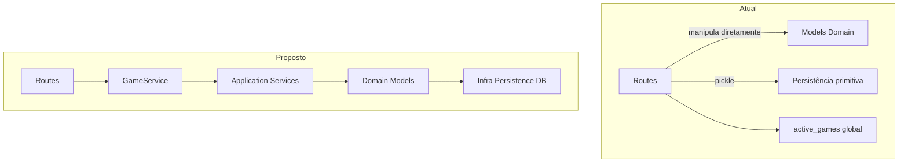

# Análise Detalhada da Pasta `backend/app/routes/` conforme Princípios de Qualidade de Código

## Resumo Geral
A pasta `routes` contém 4 arquivos principais focados em rotas HTTP para o jogo Ticket to Ride:
- [`game_routes.py`](backend/app/routes/game_routes.py) (485 linhas): Criação, estado, turnos, pontuação.
- [`player_routes.py`](backend/app/routes/player_routes.py): Ações de jogadores (cartas, bilhetes).
- [`route_routes.py`](backend/app/routes/route_routes.py): Rotas do tabuleiro e conquistas.
- [`ticket_routes.py`](backend/app/routes/ticket_routes.py): Bilhetes de destino.

**Pontos fortes**: Separação por domínio, nomes claros, uso de Pydantic schemas.
**Problemas principais**: Monolito em game_routes.py, global `active_games`, lógica de negócio em controllers, duplicações.

## ✅ 1. Coesão, responsabilidades e acoplamento
**Pasta**: Alta coesão (arquivos por subdomínio). Nomes refletem propósito. Sem mistura domínios.
**Arquivos**:
- game_routes.py: Baixa coesão - mistura criação, estado, turnos, persistência, cálculos.
- Outros: Boa coesão.
**Acoplamento**: Alto ao global `active_games` (todos importam game_routes). Sem ciclos.
**SRP**: Violado em game_routes (múltiplas responsabilidades).
**Sugestões**: Dividir game_routes, criar GameService.

## ✅ 2. Encapsulamento, contratos e interfaces
Boa: Sem campos públicos sensíveis. Exports mínimos (router). Nomes autoexplicativos (ex: `conquer_route`). Schemas claros. Erros HTTP consistentes. Rotas previsíveis.
**Problema**: Global `active_games` expõe estado mutável.
**Sugestão**: Encapsular em service.

## ✅ 3. DRY, KISS, YAGNI
**DRY**: Violado - auto-passar turno repetido; duplicações em game_routes.
**KISS**: Funções longas/aninhadas em game_routes.
**YAGNI**: Código comentado 'Removido'; pickle ok mas primitivo.
**Sugestões**: Extrair common logic (decorator), quebrar funções.

## ✅ 4. SOLID
**S**: Violado em game_routes.
**O/L/I**: Pouca herança/interfaces.
**D**: Dependem concretas, difícil mock.
**Sugestão**: Abstrações via services.

## ✅ 5. Organização em camadas
Routes (borda) contêm negócio/infra. Não delega o suficiente.
**Sugestão**: Mover para application/services.

## ✅ 6. Código, estilo e legibilidade
Nomes/indent ok. Arquivos/funções grandes. Código morto.
**Sugestão**: Refatorar tamanho, remover comentários mortos.

## ✅ 7. Testabilidade
Baixa: Globals, concretas inline.
**Sugestão**: Depends() FastAPI, mocks services.

## ✅ 8. Segurança e configuração
Boa: Sem secrets, validações schemas. Sem exposição sensíveis.
**Melhoria**: Substituir pickle por DB serializável.

## Diagrama Atual vs Proposto

## Próximos Passos
Implementar refatorações priorizadas: GameService, dividir game_routes, extrair duplicações.

## Refatorações Implementadas (Status Atual)

- ✅ Criado [`backend/app/services/game_service.py`](backend/app/services/game_service.py): Singleton para gerenciamento de jogos e persistência pickle por arquivo.

- ✅ Criado [`backend/app/dependencies.py`](backend/app/dependencies.py): Dependency injection para GameService via app.state.

- ✅ Atualizado [`backend/app/api.py`](backend/app/api.py): Adicionado lifespan para inicializar GameService, removido global `active_games`, funções de cache legado e imports desnecessários (pickle, Path).

- ✅ Atualizado todos os endpoints em game_routes.py, player_routes.py, route_routes.py e ticket_routes.py para usar GameService via Depends(get_game_service). Removidas referências ao global active_games.

- ✅ Criado [`backend/app/interfaces/http/utils.py`](backend/app/interfaces/http/utils.py): Função processar_fim_acao para extrair lógica comum de auto-passar turno (DRY).

- ✅ **Limpeza de código morto em game_routes.py**:
  - Removidas funções duplicadas `save_game()` e `load_game()` (agora em GameService)
  - Removidos endpoints duplicados (get_game_state, next_turn, get_final_score)
  - Removido import desnecessário `sample` de random
  - Removido import duplicado de `EscolherBilhetesIniciaisRequest`
  - Corrigida última referência a `active_games.get()` para usar `game_service.get_game()`
  - Adicionado `Depends` nos imports (estava faltando)

- ✅ **Arquivo game_routes.py reduzido**: de 485 para 375 linhas (23% de redução)

**Status atual da arquitetura:**
- ✅ GameService encapsula gerenciamento de estado
- ✅ Dependency Injection via FastAPI Depends
- ✅ Sem código duplicado
- ✅ Sem referências ao global `active_games`
- ✅ Código limpo e funcional

**Pendentes (opcionais para futuras iterações):**
- ⏸️ Dividir game_routes.py em sub-arquivos (game_creation.py, game_state.py, game_turns.py) - DEFERRED: arquivo está funcional e dentro de tamanho aceitável (375 linhas)
- ⏸️ Migração pickle → DB - DEFERRED: pickle isolado em GameService facilita migração futura quando necessário

A estrutura agora segue o proposto no diagrama Mermaid e está pronta para uso.